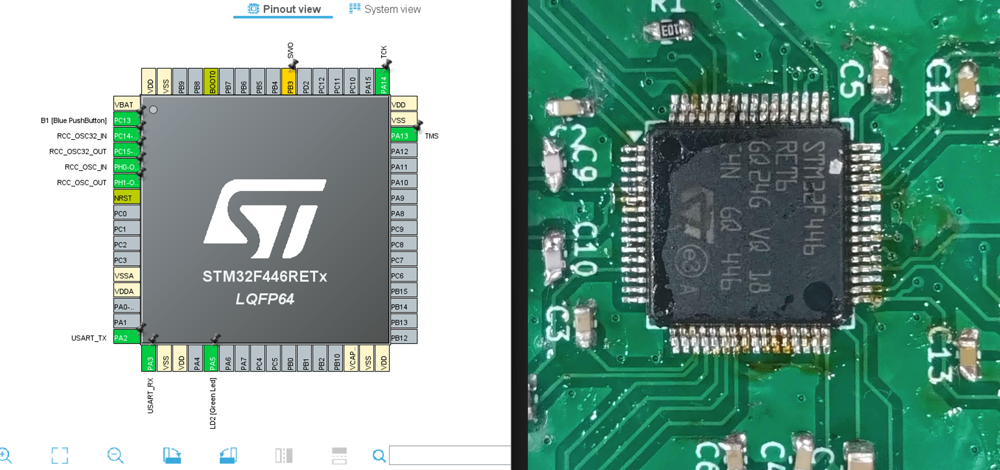

# PIN設定をしよう
## そもそもの仕組み
ロボコン(特に低レイヤ)では主に、  
- CAN通信
- UART通信・USART通信
- GPIO
- PWM(GPIOピンでやる)  

これらを使ってロボットを動かします。そして、ロボットの心臓ともいえるのがマイコンです。マイコンからたくさん生えている脚のようなもののことを **PIN** といいます。  
マイコンは、PINに加わる電圧によって制御を行います。これが、あの小さなマイコンが動作している基本的な考え方です。  
下の画像のように、STM32CubeIDEに表示されている小さな長方形たちが現実のマイコンのPINと対応しています。よく見ると分かりますが、PINにはそれぞれ、PA0やPC3、その他いろいろな名前がついており、各PINによってそれぞれできることが違います(先ほど挙げたような通信方法も特定のPINで行います)。  

  

さて、ここからはいよいよ実際にモノを動かしていきます。ここから先は、次回(第一弾)はGPIO、第二弾はPWM制御、第三弾はUART通信(USART通信もやるかも...?)、第四弾はCAN通信をやっていく予定です。気合入れていきましょう。  
