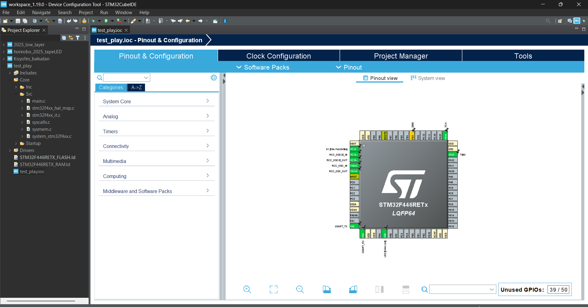
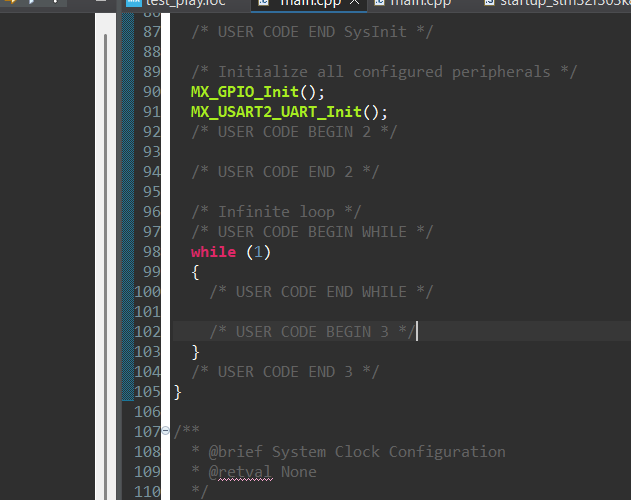
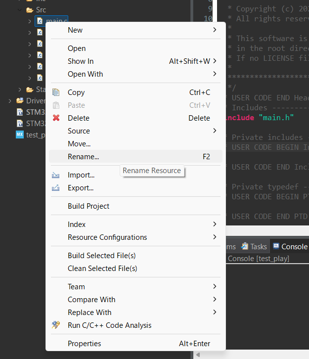

# GPIOをやろう
## GPIOとは?
我々が今からやっていくのはGPIOです。GPIOとは、制御方法の中でも比較的簡単なものです。電圧の高い状態(High)と、電圧の低い状態(Low)をそれぞれ1と0に見立てて、LEDのON・OFFなどを行う制御方法です。言葉で説明するより実際に手を動かしたほうがわかると思うので、早速やっていきましょう。  
## PIN設定とコーディング  
まずは、STM32CubeIDE(めんどくさいのでこれ以降はSTM呼びでいきます)を起動して、PIN設定の画面を開きます。初回の時点から何もいじっていなければ起動後に勝手に設定画面になっているはずです。もしもコードの画面になっている場合は、下の画像の一番下にある、**test_play.ioc** と書いてあるところをダブルクリックすると開けます。  

  

下のようになればOKです。 

  

PIN設定をします。今回は、基板についている3つのLED1～3を順番に光らせることを最終目的とします。著者が今回使う基板はLED1～3に対応するPIN(つまり、それぞれのLEDに電圧を加えたりするためのPIN)は、それぞれPC10,PC11,PC12だったので、その3つのPINを設定していきます。  
ところで、基板についているLEDに対応するPINは基板によって違います。基板を凝視すればわからないこともないのですが、それはめんどくさいので **回路図** を見ましょう。  
回路図とは、ロボコンの回路班(著者の時代はそう呼ばれている班)が作ってくれる、その基板のどこのPINが何に対応しているかが書いてある図です。  

  

これはその回路図を拡大したものです。左にはPA0やPC10などのPINと、GPIOやLEDなどの情報が書いてあります。親切な人は右側の青文字のように、どのPINがどこに対応しているのかまとめてくれたりします。  
左側をよく見ると、LED1や、CAN1_RXなど、先端がとがってる方が黄色の四角側に向いてるものと、CAN1_TXなどの尖っているのが外側に向いてるものがあります。これは、入力と出力の関係を表しています。わかりやすく言うなら、 **こちら(マイコン)側から出力を決めるときは外側を向いていて、何かが送られてくるとき(マイコンが受信するとき)は内側を向いている。** ということです。  
...実は著者の回路図は誤りがあります。LED1～3のところを見ると、内側を向いています。しかし、LEDの出力は外部から勝手に決まるわけではなく、もちろん我々が制御するので外側を向いているべきです。回路図の作成者はあとで叱っておきます。PINのことに関して大体のことはわかってきたのでPIN設定の画面に戻りましょう。   
回路図に従い、PC10と書かれている長方形をクリックすると、このようにいろいろ出てきます。  

  

これは、このPINに備わっている機能の一覧で、たった一つのPINでもいろいろなことができるのが分かります。この一覧から、今回はGPIO_Outputをクリックしてください。これにより、今回このPINが担う機能が決定しました。  
なぜGPIO_Outputを選んだかというと、先ほども言ったとおり、今回はこちら側から電圧を制御してLEDを光らせるので、われわれが"出力する"つまりはOutputというわけです。GPIO_Outputを押すと、下の画像のように四角が緑色になります。これからいろんなPINを設定していくと、緑ではなく黄色になる場合がありますが、それは今後話します。ちなみに、設定したPINの長方形をクリックして一番上のReset_Stateをおすと設定がリセットできます。  
画面左にあるCategoriesから、System_Coreをクリックすると、下の画像のようにDMAや、GPIOなどが出てきます。  

  

GPIOをクリックして、下の画像にある、黒の三角を押すと隠れていた設定画面が出てきます。 

  

下の画像のように、SYS、RCC、USART、GPIOなどがあります。これは、System_Core全体の設定選択画面です。今回はGPIOを設定するので、GPIOを選択します。ほかの機能は今後説明していくので、今はそのままで大丈夫です。  

  

今回PIN設定したPC10の欄の一番右の欄は、Modifiedの欄になっています。  
これは、何か設定を変更したときに、その目印としての役割をします。System_Coreでは、何か設定を変えると勝手にチェックが付くので何もしないで大丈夫です。次回やる、GPIOの進化系のPWMでは自分でチェックを入れることができます。あくまでもただの目印であって制御には何も影響しないので、次回こいつが出てきたときは、チェックを入れても入れなくてもどちらでも構いません。心配ご無用です。  
それではここでPINの設定はおしまいにして、クロック設定に入ります。  
画面の上の方にあるPinout&Configurationの隣にあるClock Configurationをクリックすると、下の画像のような画面が出てきます。  

  

これは、このマイコンで行う制御の、タイマーや周波数の大本の設定画面です。画面左下にあるHSEおよびHSIは、それぞれ、
- High Speed Internal oscillator(内部水晶振動子)
- High Speed External oscillator(外部水晶振動子)  

のことです。外部のほうが内部の物よりも精度がいいと言われているので、基本的にはHSEを選択しておきましょう。  

  

画面右端にあるAPB1 Timerclocksを見ると、デフォルトでは84になっていますが、先ほどHSEを選択したので42になっているはずです(下の画像はHSE設定前)。  

  

ここを選択して、50に設定し、Enterを押すと下の画像のようにほかの値が勝手に切り替わります。これは、HSE設定&APB1が最終的に50MHzになるように設定したため、計算結果がそうなるようにほかの値が自動的に調整されたということです。なぜ50に設定するのかは次回のPWMの時にお話しします。  

  

先ほどのPIN設定と同様に、PC11、PC12も設定し、 **Ctrl + s** で保存すると、下の画像のようにDo you want to generate Code?つまり、「コードを生成しますか?」と聞かれます。我々が設定したPIN設定とクロック設定に対応したコードを生成するかどうかということです。下にあるRemember my decisionは、Ctrl + sを押されたら次からはDo you want to generate Code?と聞かずに自動で保存するかどうかを聞かれています。これについてはとある事情があるため、いまはチェックを入れないでください。次回これについてお話しします。 

  

Do you want to generate Code?の画面で、Remember my decisionにチェックを入れずに右下のYesを押すと、下の画像の様なものが出てきます。これは、コードの編集画面を表示するかどうかを聞いています。Yesを押すとコーディング画面に、Noを押すと、PIN設定を保存し、それに応じたコードを生成し、コーディング画面には移動せずにPIN設定の画面のままになります。どちらを押そうが結局はコーディング画面を後で開けるのでYesを押しましょう。Remember my decisionについては先ほどと同じような感じです。  

  
## コーディングをしよう  
Yesを押してしばらく経つと、下の画像のように、コーディング画面が出てきます。いよいよコードを書いていきます。  

  

ここからは、GPIOで基板のLED1～3を光らせるコードを書いていきます。C言語及びC++で書いていきますが、C言語の知識がないよ～(;´д｀)トホホという方は、下に載せておく外部リンクに飛んでお勉強してから戻ってきてください。成長したあなたをお待ちしております。 

- [苦しんで覚えるC言語](https://9cguide.appspot.com/index.html)  
C言語を詳しく学べるサイトです。  
- [C++入門 AtCoder Programming Guide for beginners (APG4b)](https://atcoder.jp/contests/apg4b?_gl=1*11he24b*_ga*MTQ0MTAzNzY2OC4xNzU1ODQzNDY0*_ga_RC512FD18N*czE3NTY3MDE5OTAkbzQkZzEkdDE3NTY3MDE5OTMkajU3JGwwJGgw)  
競技プログラミング用のサイトで提供されている学習サイトです。因みに著者はこのサイトでC言語を学びました。  

さて、いよいよコーディングをするわけですが、下の画像のように、画面左にあるProject Explorerを見てください。  

  

ここには、現在自分が持っているプロジェクトの一覧が出ています。  
フォルダ名の横にある、「>」こんな感じのマークを押すと、その中にあるフォルダ一覧が出てきます。先ほどの画像のように、test_play→Core→Srcとクリックしていくと、Srcの真下にmain.cという名前のファイルがあります。  「.c」というのは、このファイルがC言語で書いてあるということを表しています。ここを右クリックすると、下の画像のように、ファイルに対する操作が出てきます。  
このうち、Renameをクリックすると、New nameと出てくるので、main.cを、main.cppに書き換えて、OKを押してください。なぜ名前を変えるのかは次回お話しします。

あいうえお

