# GPIOの進化系「PWM」をやろう
## PWMとは?
今回は第二弾ということで、PWM制御をやっていきます。そもそもPWMとは、前回も言った通りGPIOの進化系(と私が勝手に思っているだけ)です。  
前回のGPIOは、SET(電圧がHigh)とRESET(電圧がLow)、つまりは0か1の極端な制御でした。今回やるPWM制御は、0からMAXまで **Duty比** を変え、滑らかに制御できるかなりいい感じの制御です(小並感)。早速仕組みについてお話します。
## そもそもの仕組み
先ほど出てきました「Duty比」、これが今回の肝です。  
PWMは、点灯(電圧がHighの状態)と消灯(電圧がLowの状態)を高速に切り替えることによって光を表現して、点灯と消灯の時間の長さを変えることによって、人間の眼では明るさが変わっているように見えるのです。PWM波形は、この点灯時間と消灯時間をセットで一つの周期としており、1周期の中での消灯と点灯の時間の長さの比をDuty比といいます。これが基本的なPWMの仕組みです。  
Duty比を実際に動かして理解できる簡単なツールを作ったので、下のリンクからぜひ遊んでみてください。  

[Duty比体験ツール](https://www.desmos.com/calculator/vnzy8slrl3?lang=ja)  

## 今回やること
早速やっていくわけですが、今回はPWM制御でテープLEDを光らせていきます。  
テープLEDとは、薄くてふにゃふにゃで、R(Red)・G(Green)・B(Blue)の三色で光るLEDです。3色それぞれに対応するPINでPWM制御をし、さまざまな色や明るさを表現できます。  
前回GPIOをやった時は、NUCLEO-F446REという基板を使いましたが、今回はNUCLEO-F303K8という基板を使います。何故違うものを使うのかというと、簡単にいえば「そこまで精度を必要としないから。」です。ロボコンの中でも高い精度を求められるものは主にモーターの制御です。パワーがあり、安全面にも大きくかかわるためです。それに対してLEDはただの光ですので、モーターなどに比べて制度を必要としません。そのため、前回のとは別で新しいプロジェクト(PIN設定やコードファイルの総称)を作ります。  
## 早速やってみよう
前回同様STM32CubeIDEを起動します。起動できたら、下の画像のように、画面左上にあるFileをクリックしてください。  

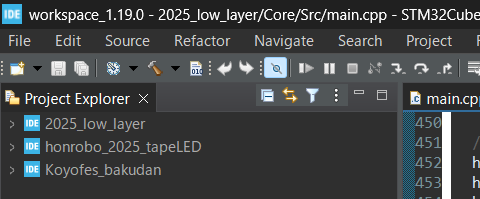  

そうすると、なんだか英語がいっぱい出てくるので、一番上のNewにカーソルを置き、下の画像のように、STM32 Projectをクリックしてください。似たような名前のものがありますが、確実に、STM32 Projectをクリックしてください。  

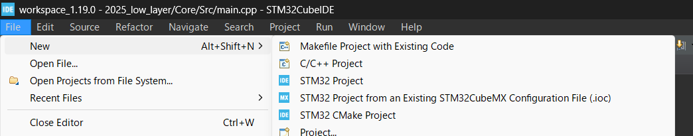  

ここから先は初回でやった手順と同じような感じです。Board Selectorを選択し、Commercial Part Numberに今回使うマイコンである303K8を入力すると下の画像のようにNUCLEO-F303K8が出てきます。  

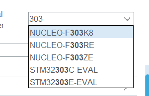  

クリックし、画面中央下の方にある星マークをクリックし、Nextを押します。　　
下の画像のようにプロジェクト名と使用言語の選択画面が出てくるので、今回はproject nameはtest_play2にして、前回同様c++を選択してFinishをクリックすると自動作成が始まります。途中、何か質問が来たらYesを押しましょう。  

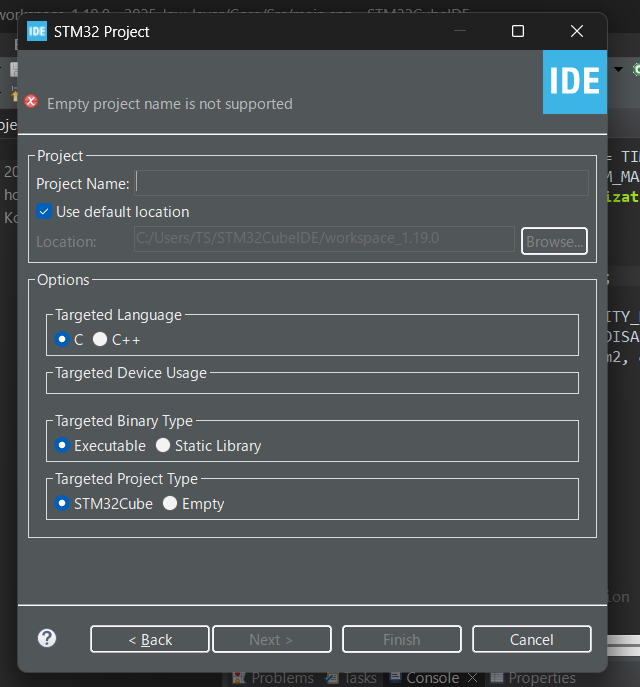  

さて、どのPINがRGBに対応するのか確認するために、回路班から拝借した回路図を見たところ、下の画像のようにRがPA5、GがPA3、BがPA6に対応しているので、それに従ってPIN設定をしていきます。  

  

PA5のところをクリックし、TIM2_CH1を選択します。PWM制御では、PWM波形を出力するPIN(今回で言えばPA3,5,6)はそれぞれ固有のタイマーを持ちます。PIN設定ではそのタイマーを決めます。  
ときどき下の画像のように、選択できるタイマーが複数個ある時がありますが、そのばあいはタイマー番号の小さい方を優先的に選びましょう。下のケースではTIM3を選びます。  

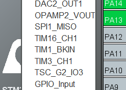  

PA3,5,6それぞれタイマーを決めると、PINの長方形が灰色から黄色に変わりました。これは、「PINの機能は決まったけど数値が決まってないよ」という状態です。前回のGPIOではそのような数値は必要なかったのでPINの機能を決めたら緑色になっていました。  
ここでいったん、Clock Configurationのほうを開きます。 

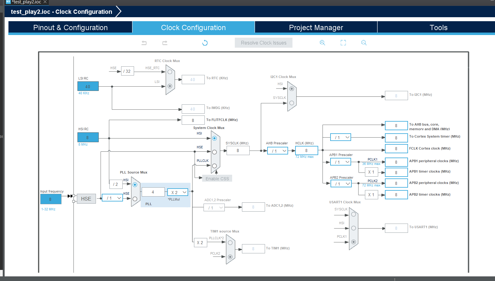  

前回同様、画面左のHSIを、HSE(外部クロック)に設定します。  
そうしたら、下の画像のように、HSEのところを/2にしてください。  

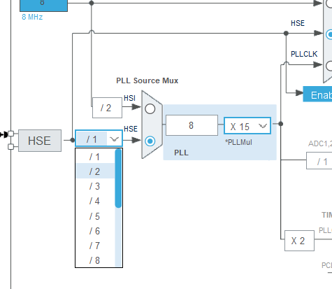  

そしたら、下の画像のようにHSI,HSE,PLLCKが並んでいるところを、PLLCKをクリックしてください。  

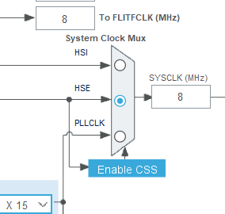  

画面右のAPB1 timer clocksを60にしてEnterを押してください。  

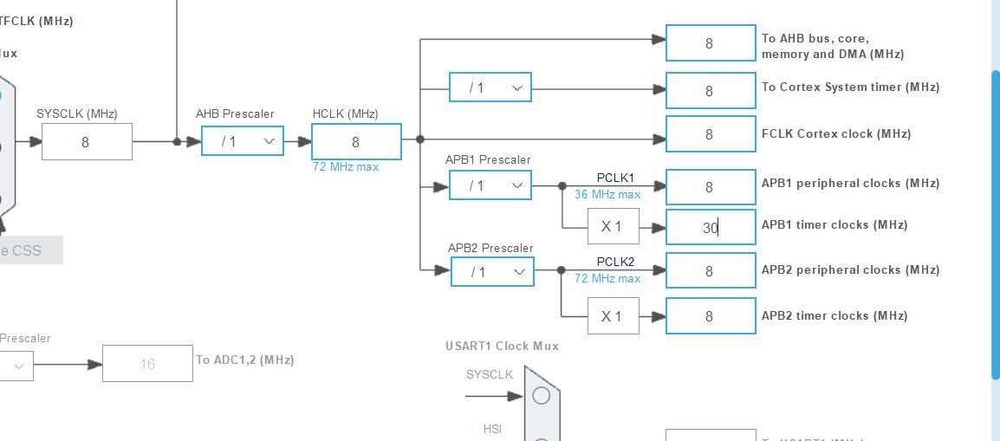  

クロック設定が出来たら、一度PIN設定のほうに戻り、CategoriesからTimersをクリックしてください。ここでは、PINに設定したタイマーの、細かな数値設定ができます。  

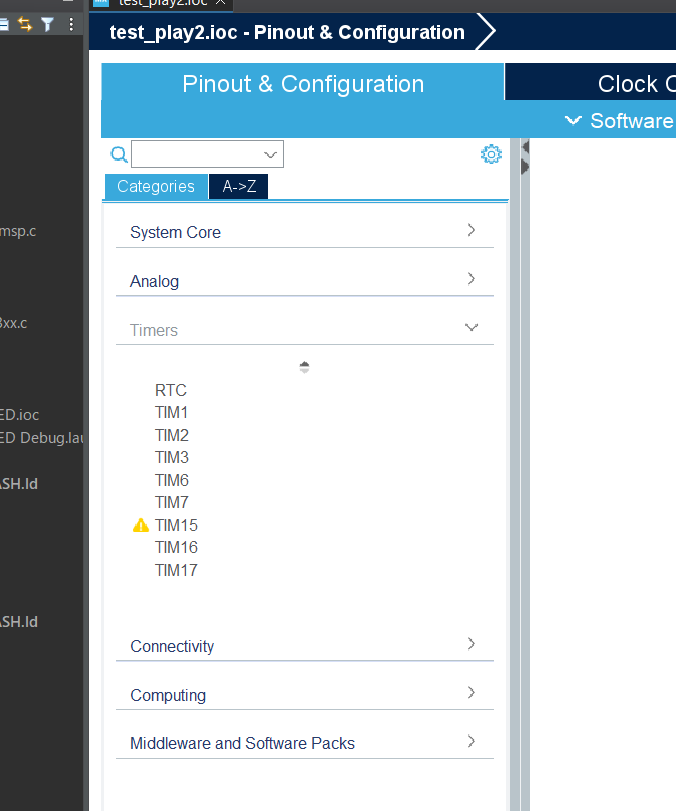  

今回はTIM2とTIM3を使うので、まずはTIM2の設定からします。  
一覧からTIM2をクリックすると、いろいろな設定項目が出てきます。そうしたら、下の画像のようにClock SourceをInternal Clockに設定し、Channel1,4をそれぞれPWMGenelationCH1,4に設定してください。 

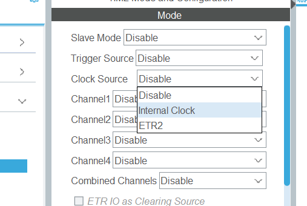

大本のクロックは外部クロックですが、TIM2,3はInternal Clock(内部クロック)を使うことで固有の周波数にすることができます。そのため、Clock SourceをInternal Clockに設定したのです。また、PWMGenelationは、その名の通りPWM波形を出力する機能なので、CH1,をそれぞれPWMGenelationに設定しました。  
次に、下の画像のように先ほど設定していた場所の下にあるConfigurationの、Parameter Settingsをクリックしてください。そうすると、TIM2に関する様々な数値設定が出てきます。  

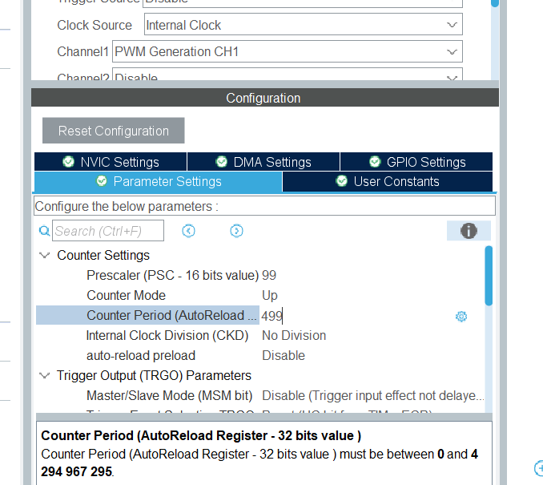  

そしたら、下の画像のようにCounter SettingsのPrescalerを99,Counter Periodを499に設定してください。  

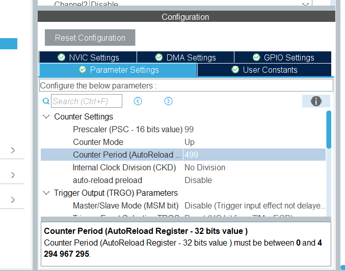  

ところで、前回はAPB1 timer clocksを50にしました。いまからその理由についてお話します。