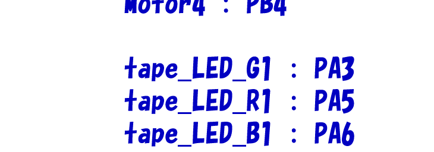

# GPIOの進化系「PWM」をやろう
## PWMとは?
今回は第二弾ということで、PWM制御をやっていきます。そもそもPWMとは、前回も言った通りGPIOの進化系(と私が勝手に思っているだけ)です。  
前回のGPIOは、SET(電圧がHigh)とRESET(電圧がLow)、つまりは0か1の極端な制御でした。今回やるPWM制御は、0からMAXまで **Duty比** を変え、滑らかに制御できるかなりいい感じの制御です(小並感)。早速仕組みについてお話します。
## そもそもの仕組み
先ほど出てきました「Duty比」、これが今回の肝です。  
PWMは、点灯(電圧がHighの状態)と消灯(電圧がLowの状態)を高速に切り替えることによって光を表現して、点灯と消灯の時間の長さを変えることによって、人間の眼では明るさが変わっているように見えるのです。PWM波形は、この点灯時間と消灯時間をセットで一つの周期としており、1周期の時間の長さと点灯の時間の長さの比をDuty比といいます。これが基本的なPWMの仕組みです。  
Duty比を実際に動かして理解できる簡単なツールを作ったので、下のリンクからぜひ遊んでみてください。  

[Duty比体験ツール](https://www.desmos.com/calculator/vnzy8slrl3?lang=ja)  

## 今回やること
早速やっていくわけですが、今回はPWM制御でテープLEDを光らせていきます。  
テープLEDとは、薄くてふにゃふにゃで、R(Red)・G(Green)・B(Blue)の三色で光るLEDです。3色それぞれに対応するPINでPWM制御をし、さまざまな色や明るさを表現できます。  
前回GPIOをやった時は、NUCLEO-F446REという基板を使いましたが、今回はNUCLEO-F303K8という基板を使います。何故違うものを使うのかというと、簡単にいえば「そこまで精度を必要としないから。」です。ロボコンの中でも高い精度を求められるものは主にモーターの制御です。パワーがあり、安全面にも大きくかかわるためです。それに対してLEDはただの光ですので、モーターなどに比べて制度を必要としません。そのため、前回のとは別で新しいプロジェクト(PIN設定やコードファイルの総称)を作ります。  
## 早速やってみよう
前回同様STM32CubeIDEを起動します。起動できたら、下の画像のように、画面左上にあるFileをクリックしてください。  

  

そうすると、なんだか英語がいっぱい出てくるので、一番上のNewにカーソルを置き、下の画像のように、STM32 Projectをクリックしてください。似たような名前のものがありますが、確実に、STM32 Projectをクリックしてください。  

  

ここから先は初回でやった手順と同じような感じです。Board Selectorを選択し、Commercial Part Numberに今回使うマイコンである303K8を入力すると下の画像のようにNUCLEO-F303K8が出てきます。  

  

クリックし、画面中央下の方にある星マークをクリックし、Nextを押します。　　
下の画像のようにプロジェクト名と使用言語の選択画面が出てくるので、今回はproject nameはtest_play2にして、前回同様c++を選択してFinishをクリックすると自動作成が始まります。途中、何か質問が来たらYesを押しましょう。  

  

さて、どのPINがRGBに対応するのか確認するために、回路班から拝借した回路図を見たところ、下の画像のようにRがPA5、GがPA3、BがPA6に対応しているので、それに従ってPIN設定をしていきます。  

  

PA5のところをクリックし、TIM2_CH1を選択します。PWM制御では、PWM波形を出力するPIN(今回で言えばPA3,5,6)はそれぞれ固有のタイマーを持ちます。PIN設定ではそのタイマーを決めます。  
ときどき下の画像のように、選択できるタイマーが複数個ある時がありますが、そのばあいはタイマー番号の小さい方を優先的に選びましょう。下のケースではTIM3を選びます。  

  

PA3,5,6それぞれタイマーを決めると、PINの長方形が灰色から黄色に変わりました。これは、「PINの機能は決まったけど数値が決まってないよ」という状態です。前回のGPIOではそのような数値は必要なかったのでPINの機能を決めたら緑色になっていました。  
ここでいったん、Clock Configurationのほうを開きます。  

  

前回同様、画面左のHSIを、HSE(外部クロック)に設定します。  
そうしたら、下の画像のように、HSEのところを/2にしてください。  

  

そしたら、下の画像のようにHSI,HSE,PLLCKが並んでいるところを、PLLCKをクリックしてください。  

  

画面右のAPB1 timer clocksを60にしてEnterを押してください。  

  

クロック設定が出来たら、一度PIN設定のほうに戻り、CategoriesからTimersをクリックしてください。ここでは、PINに設定したタイマーの、細かな数値設定ができます。  

  

今回はTIM2とTIM3を使うので、まずはTIM2の設定からします。  
一覧からTIM2をクリックすると、いろいろな設定項目が出てきます。そうしたら、下の画像のようにClock SourceをInternal Clockに設定し、Channel1,4をそれぞれPWMGenelationCH1,4に設定してください。 

大本のクロックは外部クロックですが、TIM2,3はInternal Clock(内部クロック)を使うことで固有の周波数にすることができます。そのため、Clock SourceをInternal Clockに設定したのです。また、PWMGenelationは、その名の通りPWM波形を出力する機能なので、CH1,4をそれぞれPWMGenelationに設定しました。  
次に、下の画像のように先ほど設定していた場所の下にあるConfigurationの、Parameter Settingsをクリックしてください。そうすると、TIM2に関する様々な数値設定が出てきます。  

  

そしたら、下の画像のようにCounter SettingsのPrescalerを59,Counter Periodを999に設定してください。  

 

ここで、Counter SettingsのPrescalerを59,Counter Periodを999,APB1 timer clocksを60にした理由をお話しします。  
まず、大本のクロックの周波数がAPB1 timer clocksの値であり、今回の場合は60MHzです。そして、Prescalerは「APB1 timer clocksを遅らせて、使いやすくするための値」です。この値が大きいほど、TIMが使うタイマークロックのスピードが遅くなります。  
次に、Counter Periodは、「APB1 timer clocksをPrescalerを使って遅らせて出来上がったタイマークロックの周波数を決める値」です。この値が大きいほど周波数が高くなります。  
APB1 timer clocksの50MHzでは周波数が高すぎるので、これらで使いやすい速さにしているのです。最終的なTIMの周波数fを表す式は、  

f=(APB1 timer clocks)/((Prescaler+1)(Counter Period+1))  

です。今回の場合だと、計算した結果、fは1KHzになります。これが、TIM2の周波数です。  
この式では、APB1 timer clocksが割られるので、ここがキリの悪い数字だと計算後の周波数が無限小数になってしまったりします。そのため、APB1 timer clocksは10の倍数にすることを推奨します。これぐらいの計算なら手計算でもできると思いますが、計算合ってるかちょっと心配だよという人のために計算ツールを作っておきました。  

[周波数計算機](https://www.desmos.com/calculator/01muv0f9tb?lang=ja)  

そして、下の画像のようにHCLKの下に周波数の最大値が描かれています。HCLKはなるべく最大値に近くなるようにAPB1 timer clocksを設定しましょう。これが前回、「次回お話しします」と言っていたAPB1 timer clocksを50にする理由です。  

  

TIM3も同じ数値で設定して、Ctrl + sで保存し、前回同様いくつかの質問に対してYesを押すとコードが自動生成されます。  
## コーディングをしよう
さて、今回は何度も言いますがPWMでRGBを制御していろんな光を表現します。今回使う関数はこちら  
`HAL_TIM_PWM_Start(&htim〇, TIM_CHANNEL_～)`と、`__HAL_TIM_SET_COMPARE(&htim〇, TIM_CHANNEL_～, x)`  
です。どちらもHALライブラリの関数です。  
HAL_TIM_PWM_Start(&htim〇, TIM_CHANNEL_～)は、PWMに使うタイマーを開始させる関数です。  
例えば今回のPA6のタイマー(TIM3 CHANNEL_1)の場合、〇には3,～には1が入り、`HAL_TIM_PWM_Start(&htim3, TIM_CHANNEL1)`となります。これでTIM3CHANNEL1のタイマーが開始しました。 
これは必ず `__HAL_TIM_SET_COMPARE(&htim〇, TIM_CHANNEL_～, x)` よりも前に書いてください。そうしないとタイマーが開始しません。  
続いて`__HAL_TIM_SET_COMPARE(&htim〇, TIM_CHANNEL_～, x)`  です。この関数は、指定したPINのタイマーに応じてこれぐらいのDuty比で出力します　という関数です。PA6のタイマー(TIM3 CHANNEL_1)の場合、先ほど同様〇には3,～には1が入り、xには点灯時間のカウント数を入れます。  
Duty比についてですが、xに入る値の最大値は我々が設定したCounter Periodの値によって変わります。Counter Periodの説明は先ほどしましたが、もう少しわかりやすく言うと、「1周期の間に何回カウントするか」ということです。この値が何に使えるかというと、もしもCounter Periodが999だった時、1周期の間に1000カウント(Counter Period+1がカウント数になります。)するので、そのうちの何カウント分光らせるかを考えることができます。  
例えば1周期のカウント数が1000、Duty比が50%の時は、1000カウントのうち500カウント点灯させることになります。Duty比が1%の時は、1000カウントのうち10カウント点灯させることになります。  
少しややこしいですが、Duty比(パーセント表記)=100*(x+1)/(Counter Period+1)となります。つまり、xの最大値=Counter Periodなのですが、ややこしい場合はxの最大値=Counter Period+1でも最大出力は出るのでこっちを使っても大丈夫です。  
早速コーディングをしましょう。  
今回は、Rがフェードイン→フェードアウト→Gがフェードイン→フェードアウト→Bがフェードイン→フェードアウト→RとG同時に最大点灯→消灯→BとG同時に最大点灯→消灯→すべて最大点灯→消灯  
をやります。前回同様、下の画像のようにmain.cを開きます。  

  

タイマー開始の宣言は一度だけでいいので、100行目の、 USER CODE BEGIN 2の下に書きます。下の画像のようになります。  

続いて、111行目あたりにある USER CODE BEGIN 3の下に書いていきます。フェードイン及びフェードアウトは段階的に出力を変えるのでfor文を使います。フェードがゆっくりに見えるようにHAL_Delay()を入れておきましょう。同時点灯は__HAL_TIM_SET_COMPARE(&htim〇, TIM_CHANNEL_～, x)を二行書けばいいので簡単です。  
あくまでも一例ですが、下の画像のようになります。  

  

同時点灯は下の画像のようになります。  

Ctrl + sで保存します。そしたら、前回同様にファイル名をmain.cからmain.cppに変えてからビルドをしてください。0 error, 0 warnigsとなれば完了です。  
ここで、前回、「次回お話しします」と言っていたmain.cppにする理由をお話します。  
前回も今回もライブラリの関数を使ってきたわけですが、ライブラリを使うためにはc++にしなければならず、ビルドもcppじゃないと行ってくれない(らしい)ので、コーディング後にはcppにしています。  
cppにした後、時々PIN設定のほうを間違えている場合があり、それをPIN設定画面で修正することがあります。その後、Ctrl + sをした時、mainファイルが.cppだと、それとは別に新しくmain.cファイルが自動生成されます。これは、自動生成が.cファイルでしか行ってくれないため、もともと書いていたmain.cppファイルは別物として認識されてしまうためです。これを避けるためには、自動生成される前に.cに書き換えておく必要があり、前回紹介したRemember my decisionにチェックを入れてしまうと、Ctrl + sをした時に確認の画面を出さずに、つまりはこちらに確認のすきを与えずに生成してしまうため、Remember my decisionはチェックを入れないことを推奨します。  
さて、ビルドが終わったらいよいよ動かします。前回同様ST-Linkを接続し、虫のマークを押してデバッグします。再生ボタンを押したら、いい感じに光り出します。  
もしうまく動かなかった場合は、どこかの設定をミスってる可能性があります。どこを確認してもミスが無かったのに動かないという場合は、回路班を疑いましょう。遠慮なく問い詰めましょう^^  
今回のPWM制御はこれにて終了です。次回はUART通信をやります。お楽しみに!  

2025/09/03 NAMATAMAGO314
