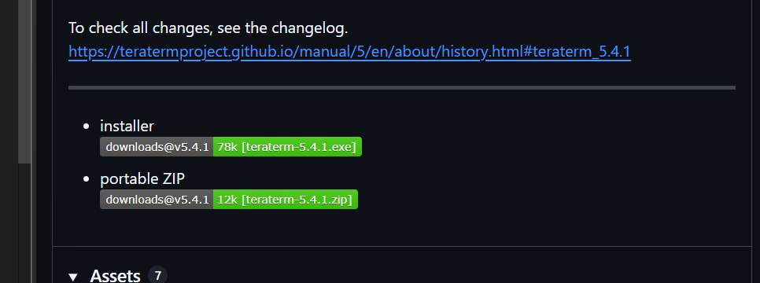
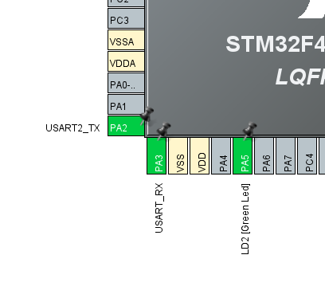
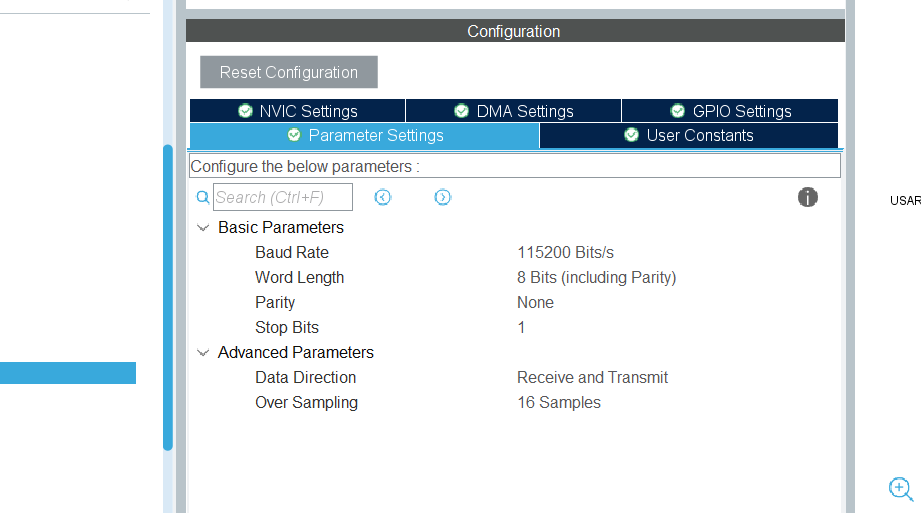
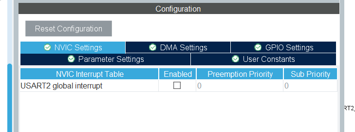
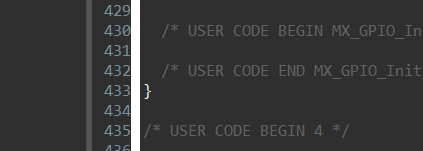
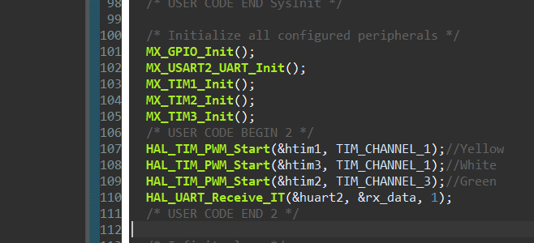

# UART通信をやろう
## UART通信とは?
今回はUART通信をやっていきます。UARTとは、Universal Asynchronous Receiver/Transmitterの略で、異なる機器同士がデータをやり取りするための仕組みです。  
ロボコンでは、PCと基板(マイコン)、基板と基板など、機器間で通信をすることでデータをやり取りしロボットを動かしています。通信というぐらいなので、 **送信側** と **受信側**  
の二者がいます。今回はTera Term という送受信アプリとマイコン(NUCLEO-F446RE)を使って、PC-マイコン間通信をします。具体的には、  
Tera TermからDuty比(パーセンテージ)を送る → マイコン受信成功したらメッセージをTeraTermに送信 → マイコンでPWMでLED光らせる  
という通信をします。  
## TeraTermを入れよう
まずはインストールをします。下のリンクをクリックして、下の画像のようにinstallerをクリックしてダウンロードしましょう。2025年9月現在の最新バージョンの画像です。
[TeraTermインストールリンク](https://github.com/TeraTermProject/teraterm/releases)  



クリックしてファイルダウンロードできたら、どの機能を追加でダウンロードするか選択できるので、下の方の機能は全部クリックしておきましょう。機能は多い方がいいですからね。出来ましたら、一度閉じて、UARTの仕組みについて先にお話しします。
## そもそもの仕組み
UART通信は、2本のケーブルを使って送信側と受信側でデータをやり取りする通信の事で、クロック信号などの外部信号ではなく、あらかじめ決められた通信速度(ボーレート)で通信することが特徴です。ボーレートとは、1秒間に何bit遅れるかを表す指標で、115200bps,96000bpsなどがよく使われます。bpsはbits per second(ビット パー セカンド)のことです。  
## 早速やってみよう
さて、先ほどもいったとおり、今回はPCとマイコンでUART通信をします。回路班が基板を用意してくれたので、回路図に従って今回もPIN設定をしていきます。  
今回のマイコンは受信者側と送信者側の双方を担います。UARTに使うPINは **USART_TX** と **USART_RX** です。TX(Transmit:送信)と、RX(Receive:受信)のPINです。  
ただ、前回のF303K8はテープLEDを使うために回路班に作ってもらった基板でしたが今回著者が使うのはST公式が提供している基板なので、テープLEDを光らせることに特化していません。つまり、3色それぞれの出力ピンがばらばらに配置されているのです。そのため、テープLEDではなく3つのLEDを別のブレッドボードに用意し3色のLEDを光らせることにしました。下の画像がそれです。回路班のT君に感謝。  


PA8,PB4,PB10をそれぞれ黄,白,緑に対応させています。  
いつも通り新しいプロジェクトを作成して、PIN設定画面を開きます。PWMは前回やったのでざっくりと説明します。  
PA8,PB4,PB10をそれぞれTIMを設定し、Prescalerは83,Counter Periodは999にしましょう。ここからも分かる通り、今回はAPB1 timer clockは84MHzです。  
UART_TX,RXについては下の画像のようにデフォの状態で既に設定されています。  

  

画像では、USART_RXと表示されています。これは、USART(Universal Synchronous/Asynchronous Receiver Transmitter)の略であり、Synchronous/Asynchronousはそれぞれ「同期/非同期」という意味で、最初に言ったクロック信号との同期の事です。USARTは外部クロックとの同期も可能であり、UARTの上位互換というわけです。ここで一度USARTの設定を外し、もう一度付け直してください。そうすると、USART2_TX,USART2_RXのようになります。これは、USART1はPA9やPA10が主に担当しており、PA2などはUSART2を使うからです(多分)。  
ここで、下の画像のようにCategoriesからConnectivityをクリックし、USART2をクリックすると、上の方にMode選択があるので、Asynchronous(非同期)を選択してください。そして、下の画像のようにParameter Settingsを選択すると、いろいろな数字が出てきます。  



Baud Rateは先述の通り通信速度です。Word Lengthは送る文字の長さです。UARtでは1文字ずつ2進数に変換してから送信するのですが、2進にした後の長さが8bitということです。  
Stop Bitsは「ここで文字列は終わりですよという合図になる文字」の長さです。あとでこれについてお話しますが今はこのままでOKです。  
Data Directionはマイコンの送受信機能に関する項目で、今回はどちらも担うのでReceive and Transmit(送受信両方)のままでOKです。Over Samplingは受信精度向上のための設定であり、そのままでOKです。 
下の画像のようにNVIC Settingsを開くとUSART2 global interruptというところが出てきます。



Enabledにはチェックを入れましょう。割り込み処理を行うためです。そしたら、Clock Configulationを開き、いつも通りHSE,PLLCLKを選択し、APB1 timer clockは84にしてEnterを押します。自動調整が終わったら、Ctrl + sで保存し、コード生成が始まります。  
## UARTのお話
UARTで文字を送る時、データは2進に変換され、スタートビット、パリティビット、ストップビットをくっつけて送信します。  
送信データ構成:[[スタート] [2進のメッセージ] [パリティ] [ストップ]]  
こんな感じです。それぞれ、  
- スタートビット（1bit）: データ送信開始を示す（常に0）
- データビット（8bit）: 2進のデータ（通常8bit）
- パリティビット（1bit）: エラー検出用
- ストップビット（1bit）: データ送信終了を示す（常に1）  

となっています。 
## コーディングをしよう
今回はPCからデータを送られたらマイコンで受信→割り込み→PWM出力でLED光らせる→メッセージをPCに送信という流れです。  
今回初めて出てきた「割り込み処理」ですが、例えばUART割り込みの場合は、「UARTで何かを受け取った時に今行っている処理を中断し、割り込み関数の中の処理を行い、完了したら中断した処理に戻る」という動きをします。  
UART割り込みに使う関数がコチラ  
`HAL_UART_Receive_IT(&huart〇, &a, n);`と`void HAL_UART_RxCpltCallback(UART_HandleTypeDef *huart){}`です。どちらもHALライブラリの関数です。  
`HAL_UART_Receive_IT`はその名の通り受信の関数で、〇にはPIN設定で我々が選択した数字が入ります(今回はUSART2だったので2が入る)。  
aは受信したメッセージを入れる変数で、今回はuint8_t型です。型は文字ではなく数ですが、UARTのお話でも言った通りその数により文字を表現しているので、  
`if(rx_data == '/')`のように中身を文字として使うことができます。nは受信するビット数で、nビット(n文字)受信するということです。  
`void HAL_UART_RxCpltCallback(UART_HandleTypeDef *huart)`(名前長すぎだろ)は割り込み処理の内容を書きます。UART_HandleTypeDef はUARTに必要な情報が入っており、huartはどのuartを使うかを表します。この部分はほぼ弄らないので気にしないでください。先に説明したHAL_UART_Receive_ITの後に書きます。  
下の画像の様に、400～450行目あたりにUSER CODE BEGIN 4というところがあります。割り込み処理はここに書くことがほとんどです。  



下の画像のように、HAL_UART_Receive_ITをmain関数の中に書いておきます。前回やったPWMのタイマー開始の関数も書きます。これにより、UART通信で最初の一文字目を受信する準備が完了します。  
先ほども言った通り今回はUSART2だったのでhuart2,受信した文字はrx_dataという変数に入れることにしました。  



PWMのDuty比はテラタームから送りますが、例えば黄32%,白0%,緑100%の場合は032/000/100というように、余った桁を0で埋め、数字同士を/で区切ったものを送ります。そのため、マイコンは受信データからスラッシュを取り除き、パーセンテージをもとに__HAL_TIM_PWM_Startで設定する点灯カウント数を計算する必要があります。  
著者が一例として書いたコードは下の通りです。USER CODE BEGIN 4の下に書くコードです。まぁかなり前回と比べてややこしいのでコピペでもいいですが(もちろんPIN番号とかは各々変えて)、コードになれるために自分で書いてもいいでしょう。  
```cpp
void HAL_UART_RxCpltCallback(UART_HandleTypeDef *huart){
  if (huart->Instance == USART2){
    if(rx_data != '/' && rx_data != '\n' && rx_data != '\r' && j<3){
    	rxbuffer[i][j] = rx_data;
    	j++;
    }else if(j>0 || rx_data == '/'){
    	rxbuffer[i][j] = '\0';
    	i++;
    	j=0;
    	if(i==3){
    		for(int num = 0;num<3;num++){
    			duty[num] = 0;
    			for(int k=0;k<3;k++){
    				duty[num] = duty[num]*10 + (rxbuffer[num][k]-'0');
    			}
    			if(duty[num]>0){
    				duty[num] = duty[num]*10 - 1;
    				if(duty[num]>999){
    					duty[num] = 999;
    				}
    			}
    		}
    		__HAL_TIM_SET_COMPARE(&htim1, TIM_CHANNEL_1, duty[0]);//Yellow
            __HAL_TIM_SET_COMPARE(&htim3, TIM_CHANNEL_1, duty[1]);//White
            __HAL_TIM_SET_COMPARE(&htim2, TIM_CHANNEL_3, duty[2]);//Green
            char msg[64];
            sprintf(msg, "successful Y:%d, W:%d, G:%d\r\n",duty[0], duty[1], duty[2]);
            HAL_UART_Transmit(&huart2, (uint8_t*)msg, strlen(msg), HAL_MAX_DELAY);
            i=0;
    	}
    }
    HAL_UART_Receive_IT(&huart2, &rx_data, 1);
  }
}
```

解説していきます。`if (huart->Instance == USART2)`は、UARTで受信したときに、それがUSART2に来たものであるかを確認しています。  
`if(rx_data != '/' && rx_data != '\n' && rx_data != '\r' && j<3)`は、メッセージのうちそれがDuty比を表す数字の一部であるかを確認しています。テラタームの仕様についてはあとでお話ししますが、メッセージの最後ですよという目印として改行コードをメッセージの最後にくっつけて送られます。それが\nと\rです。メッセージのうち改行コードでもなくスラッシュでもない文字、つまりDuty比を表す数字を判別しています。`rxbuffer[i][j]`はchar型の配列で、`rxbuffer[i][j] = rx_data;`によりrx_dataに格納されたデータを一つずつ文字として格納しています。  
`else if(j>0 || rx_data == '/')`は、スラッシュ及び改行コードのうち、2個目のスラッシュかもしくはメッセージの最後の改行コードであるかを確認しています。`rxbuffer[i][j] = '\0';`の\0は終端文字と呼ばれ、これが無いとデータがどんどんずれてしまいます。i==3で3色すべてのメッセージを受信し終えたことを確認し、実際の出力へと変換していきます。  
`duty[num] = duty[num]*10 + (rxbuffer[num][k]-'0');`ですが、duty[num]はint型の配列で、Duty比の情報に計算を加えて最終的にこれが点灯カウント数になります。  
`rxbuffer[num][k]-'0'`はアスキーコードにより文字を数値に変換しています。文字にはそれぞれ固有のアスキーコード(ユニコードみたいなやつ)があります。0～9の数字にももちろんアスキーコードがあり、 **「数字xのアスキーコード」-「0のアスキーコード」** を計算すると、文字としてではなく、数字としてのxの値が出てきます。これによりrxbuffer[num][k]-'0'は、rxbuffer[num][k]に格納された文字を数値に変換しているのです。  
10倍して桁移動し、桁が一つ下のものを足す操作を3回行い、全てのけたを用意できたら、前回やった__HAL_TIM_SET_COMPAREでPWM出力をします。  
`sprintf`は文字列を作る関数で、#include <cstdio>により使用できるライブラリの関数です。また、strlen(msg)は文字列の長さを求める関数で、#include <string.h>により使用できるライブラリの関数です。`HAL_UART_Transmit(&huart2, (uint8_t*)msg, strlen(msg), HAL_MAX_DELAY);`はHALライブラリの関数で、UARTで文字を送信する関数です。huart2が今回のUARTで、(uint8_t*)msgが送るメッセージ、先ほども言ったとおりstrlen(msg)は送る文字列の長さで、HAL_MAX_DELAYは待機時間です。  
処理が終わったら`HAL_UART_Receive_IT(&huart2, &rx_data, 1);`で次の受信を待ちます。rxbufferなどは66行目あたりの USER CODE BEGIN 0の下で定義しておきましょう。  
## Tera Termから送信しよう
あとはTeraTermの設定を終えれば通信の準備が整います。頑張りましょう。  
ST-Linkを接続した後にテラターム
