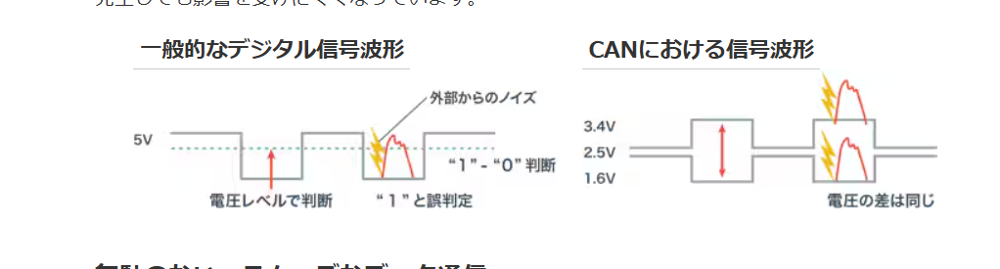

# CAN通信をやろう
## CAN通信とは?
今回やるのはCAN通信です。CANはController Area Networkの略で、今までのUARTやGPIOとは違う点がいくつかあります。  
前回やったUARTはマイコンと一つのデバイス間で行われる1対1の通信ですが、CANはマイコン一つに対し複数のデバイスと通信することができ、たった2本のケーブルで行うことができます。  
また、他の通信ではモーターの回転量などの情報を取得するためにはこちら側から関数で取得する必要がありますが、CAN通信ではモーターから勝手に送られてきます。CANはノイズに強いという特徴も持っています。これは、UARTなどは一つの線で電圧の大きさでデータのやり取りを行いますが、CANはCAN_HighとCAN_Lowの二線の電圧の差の大きさで通信をしています。　　
そして、通信中に何らかの影響でノイズが入り、電圧が乱れてしまうことがあります。CAN以外の通信だと、この場合通常通りの通信ができなくなります。しかし、CANの場合は2線があり、ノイズは必ず両方に同じだけ影響するので結局のところ差が保たれ、通常通りに通信ができます(下の画像の通り)。これがCANがノイズに強い理由です。  

同じ線で複数の機器と通信できるのは、CAN IDという識別用のIDを機器それぞれが持っていて、それによって判別ができるからです。CANIDは16進数であらわされ、「0x100」や、「0x030」といった感じになっています。今回はモーターからCANを受け取ってCAN割り込みをするのですが、その際もメーカーによってあらかじめモーター固有のIDを決められています。  
### CANフィルター
今回はモーター1つを制御するのですが、実際のロボコンでは4輪の足回りなど複数のものを扱う場合がほとんどのため、複数のマイコンで分担して制御をすることがあります。その場合、CANが混同しないように分別する必要があります。分別に使うのが **CANフィルター** という機能です。